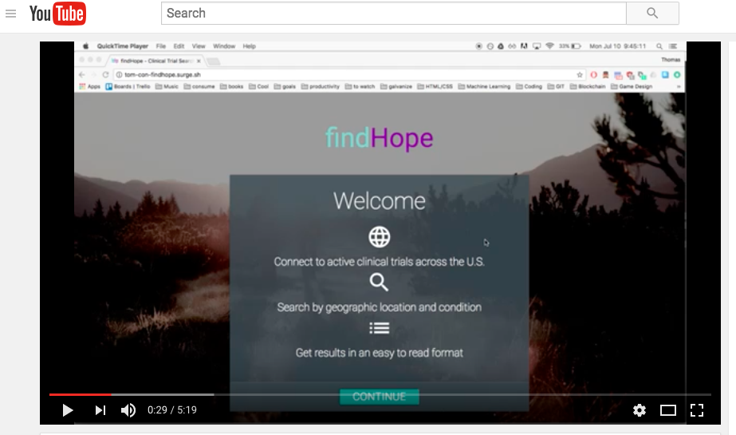

# findHope

A Web App designed to connect cancer patients with relevant clinical trials using the National Cancer Institute's Clinical Trial API, Google Maps API, and Crosref API. This project is presented in HTML and CSS, using a Materialize framework. Javascript is implemented to allow functionality along with the jQuery library.

### Getting Started
Check out the video walkthrough below to see the features of the website:

### Features
- User searches for a cancer condition and is given a list of potential conditions that they want to search for
- User selects the matching conditions and enters in their age, biological sex, whether they want clinical trials that are currently accepting volunteers
- findHope then locates all clinical trials that match the search criteria, and populates a Google Map showing the locations available
- findHope also provides information about the principal investigator and any publications they might have

### Technologies used
- Javascript ES6, jQuery, AJAX
- National Cancer Institute's Clinical Trial API for clinical trial data-id
- Google Maps API for location services and map rendering
- Crosref API for research article publications
- Materialize CSS
- HTML5, CSS3

### Thanks for stopping by!
If you have any suggestions for improvement please contact me and let me know
